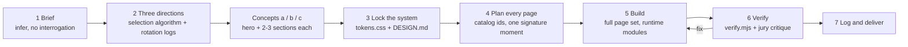

# studio-design

**A Claude Agent Skill that makes Claude design and build award-level, non-templated websites, as complete page sets rather than a lone hero section.**

You get stores, landing/product sites, and company or agency sites, written in vanilla HTML/CSS/JS with GSAP + Lenis. The output carries over to WordPress/ACF/WooCommerce and works in Hebrew/RTL from the first line.

<p align="center">
  
  <br><sub>The 33 art directions, each rendered as a live specimen page (all brands and copy are fictional). <a href="studio-design/directions/_specimens/_montage.rtl.jpg">Hebrew/RTL montage →</a></sub>
</p>

---

## The problem: the "AI template look"

Ask any model for a website and you tend to get the same one:

- a badge pill above a centred H1 with two buttons,
- three icon cards with "Learn more →",
- soft grey shadows and cream paper with a serif, or a purple-to-blue gradient,
- fade-up on every section,
- a 4-column footer.

It's competent and forgettable, and every brief comes out looking alike.

**studio-design** gives Claude a design lead's process and a large, evidence-based design vocabulary. Every client ends up with an identity nobody could mistake for anyone else's, and a *complete, working* site.

- **Varied on purpose.** Claude shortlists three maximally different art directions out of 33 and builds all three as real first-screen concepts. It also keeps rotation logs, so your next project won't drift back to the last one.
- **Complete.** You get full page sets: Home, PLP, PDP, cart, checkout, account, About, Services, Case study, Contact, legal pages, 404 and so on. Empty, error and loading states are included, and links to pages outside the brief are handled honestly.
- **Grounded in evidence.** The rules come from roughly 880 scanned sites (award galleries, top studios' client work, agency sites and the Israeli market). They're anonymized and reduced to numbers, so there's no guesswork about taste.
- **Checked by looking.** A Playwright QA script screenshots every page at 5 widths in LTR, RTL and reduced motion, then runs 27 automated checks. After that, Claude critiques the screenshots the way an awards jury would.

## What's inside

| | |
|---|---|
| **33 art directions** | Each comes with a full `tokens.css`, 3 palette drops with measured WCAG contrast, knobs, a Hebrew font stack, signature moves and a rendered specimen (LTR, RTL, mobile). → [docs/directions.md](docs/directions.md) |
| **417 catalog entries** | 29 heroes · 22 nav archetypes and effects · 13 footers · 88 content sections (features, proof, pricing, FAQ, CTA, gallery, team, stats, newsletter, case study) · 56 backgrounds · 74 widgets and micro-interactions · 135 store patterns (PLP, product cards, filters, PDP, 29 commerce widgets, cart, checkout, account, states, trust). Motion adds 21 GSAP patterns, 4 load choreographies and 5 preloaders. → [docs/catalog.md](docs/catalog.md) |
| **3 full page sets** | E-commerce: 27 pages (17 core). Landing/SaaS: 18 pages (12 core). Company/agency: 20 pages (9 core + 6 core-by-vertical). On top of those, 4 shared utility pages. → [docs/page-sets.md](docs/page-sets.md) |
| **31 runtime modules** | A copy-into-project vanilla runtime driven by `data-fx` attributes. It handles split reveals, pinned horizontal tracks, stacked cards, WebGL shader backgrounds, a 3D image sphere, scroll-scrubbed video, cart drawer, PDP with variations, Flip filtering grid, code-built 3D objects (`lathe`, `device`), colour chapters, and more. Every param maps 1:1 to an ACF field. → [docs/runtime.md](docs/runtime.md) |
| **88 anonymized case studies** | Measured study notes on type sizes, hexes, radii, section order and motion, with no names. → [docs/research.md](docs/research.md) |
| **Anti-pattern list** | 67 numbered bans, 25 "current attractors" (looks that AI output converges on, re-checked as the scans grow) and a list of banned default fonts. → [docs/quality.md](docs/quality.md) |
| **`verify.mjs`** | Playwright QA: 27 checks covering overflow, console errors, the font actually rendered per script, H1 fit, banned copy, gradient text, lazy LCP, axe contrast and more. → [docs/quality.md](docs/quality.md) |
| **Hebrew / RTL** | Each direction has its own Hebrew stack. Logical CSS only, `SD.dir()` for motion, bidi isolation rules, and Israeli market notes such as SI 5568 accessibility, ₪ formatting and the local template look to avoid. → [docs/hebrew-rtl.md](docs/hebrew-rtl.md) |
| **WordPress-portable** | Each section is one ACF Flexible Content layout, tokens map to `theme.json`, there's a WooCommerce template/hook map, and preview re-init uses `SD.destroyAll/initAll`. → [docs/wordpress.md](docs/wordpress.md) |

## Quick start

### 1. Install

**Claude Code**: copy the skill folder into your skills directory:

```bash
git clone https://github.com/DimaBobrik/studio-design.git
# for all your projects (user-level)
cp -r studio-design/studio-design ~/.claude/skills/
# or for one project only
mkdir -p .claude/skills && cp -r studio-design/studio-design .claude/skills/
```

**Claude app (claude.ai / Claude desktop)**: zip the `studio-design/` folder (the one containing `SKILL.md`):

```bash
cd studio-design && zip -r ../studio-design.zip studio-design
```

Then upload it as a custom skill in your Claude app settings. Skills need to be enabled for your account or plan.

**Other agents**: any agent that can read a `SKILL.md` and open files next to it can use the skill. Point it at `studio-design/SKILL.md`, which has a file map that tells the agent what to load and when.

**Optional, for visual QA** (recommended):

```bash
npm i playwright && npx playwright install chromium
```

### 2. Ask for a site

The skill triggers on any request to design or build a website, landing page, online store, redesign or homepage, or to show "several design options".

```text
Design a WooCommerce store for a small ceramics studio that sells handmade tableware.
Full page set. The client has good product photos.
```

```text
Landing site for an open-source observability tool for Kubernetes. Dark is fine,
but it must not look like every other AI dev-tool site. Pricing + docs teaser.
```

```text
Company site for an architecture practice: home, projects index, case study,
about, contact. Quiet, photography-led. Show me three directions first.
```

```text
Redesign the site of a regional logistics company. Keep their navy and orange brand colours.
WordPress + ACF, so map every section to Flexible Content.
```

```text
אתר תדמית בעברית למשרד אדריכלים בחיפה: בית, פרויקטים, עמוד פרויקט, סטודיו, צור קשר
והצהרת נגישות. שקט ומדויק, לא תבנית.
```

Claude replies in the language of your brief. The skill's own files are in English, and the site copy follows the brief: a Hebrew brief gets `<html lang="he" dir="rtl">`.

### 3. What you get

```
site/
  index.html, shop.html, product.html, ...   one complete file per page (index.html = Home)
  _gallery.html                              links every page + the three concepts
  concepts/a.html  b.html  c.html            the three first-screen concepts (+ index switcher)
  assets/tokens.css                          the locked design system (every value is a token)
  assets/site.css  assets/site.js            project styles and glue
  runtime/                                   core.css, core.js and only the fx modules used
  img/  fonts/                               imagery / labelled photo slots, self-hosted fonts
  DESIGN.md                                  ~50-line design system: direction, tokens, type roles, motion budget, Do/Don't
  pages.md                                   page list, section plans with catalog ids, placeholders, what is out of scope
  .studio-design/log.json                    rotation log (what was shown and chosen)
  qa/                                        verify.mjs screenshots + report.md / report.json
```

Every page renders its final state without JavaScript (motion only enhances it) and respects `prefers-reduced-motion`. Missing facts show up as visible placeholders (`[TODO: confirm]` / `[להשלמה: …]`), never as invented numbers, logos or testimonials.

## How it works



1. **Brief.** Claude pulls out the subject, audience, site type, the one job the site has to do, a tone *as an extreme*, the language/direction and the scope. Anything missing is inferred and stated in one line, and Claude asks at most one question.
2. **Three directions, genuinely different.** The candidates are filtered by site type and subject affinity. Directions chosen in the project's last 3 runs are excluded, recently shown ones are penalized, and the hero device rotates. The three picks must differ on at least 2 of paper / display family / accent band, and ties are broken with a deterministic FNV-1a seed. All three get built as real concepts that clear an **ambition floor**: a first viewport that stops the scroll, one wow moment further down, and a "second read" detail.
3. **Lock the system.** The chosen direction becomes `assets/tokens.css` plus `DESIGN.md`. From then on every page shares one system, and variety happens inside it.
4. **Plan every page.** Each page gets sections in DOM order with catalog ids, one signature moment and a motion spec table. Mechanical composition rules apply: no archetype twice per page, at least ceil(n/2) layout families, a marquee at most once.
5. **Build.** Pages are built in stages and never truncated. Imagery comes from your assets first, then generated images, then subject objects built in code, then labelled photo slots. Random stock is never used.
6. **Verify.** `verify.mjs` screenshots and checks every page. Claude then opens the shots, scores them against the jury checklist, fixes problems and re-runs.
7. **Log and deliver.** The run goes into both rotation logs, and you get the gallery, DESIGN.md, a placeholder list and, for WordPress, the ACF mapping.

When rules conflict, the precedence is: **the brief's explicit words > the chosen direction's signature moves > catalog defaults > general rules.** A ban gives way when you ask for it by name: if you ask for cream and Inter, you get them, done well.

Details: [docs/how-it-works.md](docs/how-it-works.md).

## Requirements

- **Claude** with skills support (Claude Code, or the Claude app with custom skills), or any agent that reads `SKILL.md`.
- **Node 18+ and Playwright** (Chromium) for `verify.mjs`, `render-stills.mjs`, `extract-catalog.mjs` and `scan.mjs`. `log-run.mjs` has no dependencies.
- **Python 3.9+** (stdlib only), needed only for `aggregate.py` when you grow the research base.
- Nothing else. GSAP, Lenis, Paper Shaders, cobe and fonts load from public CDNs; there's no build step and no framework.

## Repository map

| Path | What it is |
|---|---|
| [`studio-design/SKILL.md`](studio-design/SKILL.md) | The entry point: process, file map, non-negotiables, variety engine |
| [`studio-design/directions/`](studio-design/directions/) | 33 direction files + `_index.md` (table, selection algorithm, Hebrew display axis) + `_specimens/` |
| [`studio-design/catalog/`](studio-design/catalog/) | Heroes, nav, content sections, footers, backgrounds, widgets, motion, e-commerce |
| [`studio-design/pages/`](studio-design/pages/) | Page sets: `_shared.md`, `ecommerce.md`, `landing.md`, `company.md` |
| [`studio-design/references/`](studio-design/references/) | 88 anonymized case studies + aggregate statistics (`patterns.md`, `israel.md`, `agency-sites.md`, `agency-world.md`) |
| [`studio-design/runtime/`](studio-design/runtime/) | `core.css`, `core.js`, 31 `fx/` modules, 29 demo pages, `README.md` (every `data-*` param) |
| [`studio-design/scripts/`](studio-design/scripts/) | `verify.mjs`, `log-run.mjs`, `render-stills.mjs`, `extract-catalog.mjs`, `scan.mjs`, `aggregate.py` |
| [`studio-design/antipatterns.md`](studio-design/antipatterns.md) · [`checklist.md`](studio-design/checklist.md) | Ban list with current attractors · QA and jury checklist |
| [`studio-design/CONVENTIONS.md`](studio-design/CONVENTIONS.md) · [`CHANGELOG.md`](studio-design/CHANGELOG.md) | Token contract and module API for contributors · release history |
| [`docs/`](docs/) | This documentation |

## Research basis

The skill was distilled from about **880 scanned sites**:

- ~200 award-gallery sites,
- ~320 Israeli sites (agencies and the client sites they built),
- ~260 live client sites built by ~40 top world studios,
- ~100 agency/studio sites of their own, with ~160 case-study pages.

Each site was captured headlessly at 1440 and 390 px. Computed styles were extracted, every capture was looked at by eye and tiered (A = Site-of-the-Day level), and the findings were aggregated into medians and shares. Examples: the hero display median is 64–80 px at 1440; about half of award sites use no saturated accent; 0 of 52 tier-A sites use 4+ font families. Those numbers set the rules in `SKILL.md`, the directions and the catalog.

**No screenshots or site data are included in this repository. It contains only distilled rules and anonymized study notes.** Case studies describe measurable decisions behind a neutral descriptor ("a smart-ring wearable brand"), never a name, domain or copy. More detail, including how to grow the skill with your own scans: [docs/research.md](docs/research.md).

## FAQ

**Is it free?** Yes. The skill is MIT-licensed, and every dependency is free to use. GSAP has been free since 3.13, plugins included (SplitText, ScrollTrigger, Flip, MorphSVG and the rest), under GreenSock's standard no-charge license. Lenis and cobe are MIT, and Paper Shaders is Apache-2.0.

**Are fonts included?** No. Fonts load from Google Fonts (SIL OFL) or are self-hosted from Fontshare (ITF Free Font License), and the skill tells Claude how to do both. Check each family's license before you ship.

**Does it copy the sites it studied?** No. Rules were extracted from them, never pixels: sizes, ratios, section orders and motion budgets. The sites' copy, images and code are never reused, and the case studies are anonymized.

**Do I need WordPress?** No. The default output is a static site you can open locally, deploy anywhere or publish as an artifact. It's built so it can *become* a WordPress/ACF/WooCommerce theme 1:1 when needed.

**React / Next.js?** Only if you ask for it. The tokens and structure stay the same, and the effects get ported as components.

More: [docs/faq.md](docs/faq.md).

## Contributing

New directions, runtime modules, catalog rows and anonymized case studies are all welcome. See [CONTRIBUTING.md](CONTRIBUTING.md) and [`studio-design/CONVENTIONS.md`](studio-design/CONVENTIONS.md) for the token contract and module API. The one hard rule: **never commit names, URLs or screenshots of scanned sites.**

## License

[MIT](LICENSE) © 2026 DimaBobrik and contributors. Third-party notices: [NOTICE.md](NOTICE.md).

## Credits

Created by [@DimaBobrik](https://github.com/DimaBobrik), built with Claude and Claude Code. It stands on excellent free tools: [GSAP](https://gsap.com/), [Lenis](https://www.npmjs.com/package/lenis), [Paper Shaders](https://www.npmjs.com/package/@paper-design/shaders), [cobe](https://www.npmjs.com/package/cobe), [Playwright](https://playwright.dev/), [axe-core](https://github.com/dequelabs/axe-core), Google Fonts and [Fontshare](https://www.fontshare.com/). Thanks to the designers and studios whose public work raises the bar. They are deliberately not named here.
