# Directions

A **direction** is a complete art direction: a mood sentence, axes, the site types and subjects it fits (and doesn't), neighbours to avoid in the same trio, a full `tokens.css` that implements the token contract (fonts with Hebrew fallbacks in the same stack), essence, signature moves, colour roles, typography, layout, components, backgrounds, motion budget, imagery, RTL notes, Do/Don't, **3 palette drops** (each with a complete override line and measured WCAG contrast) and **knobs**.

There are **33**. Each one has a live specimen page (`studio-design/directions/_specimens/<slug>.html`) and three screenshots: `<slug>.jpg` (1440×900 LTR), `<slug>.rtl.jpg` (1440×900 Hebrew/RTL) and `<slug>.m.jpg` (390×844 mobile). Brands and copy in the specimens are fictional.

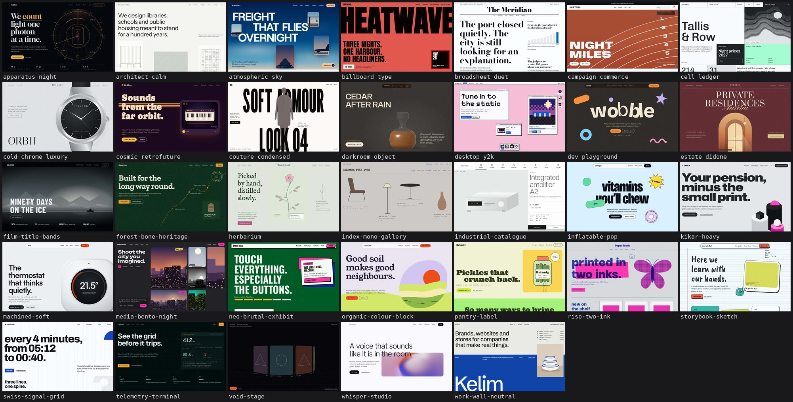

RTL montage: [`_montage.rtl.jpg`](../studio-design/directions/_specimens/_montage.rtl.jpg). To browse the specimens interactively, serve the skill folder (`python3 -m http.server -d studio-design`) and open `/directions/_specimens/index.html`.

## Reading the table

- **Axes**: paper band · display style · accent band · radius system · density-variance-motion (0–10 each). See [how-it-works.md](how-it-works.md#the-axes).
- **Fits**: the site types the direction is allowed for (`ecommerce`, `landing`, `company`).
- **Hebrew display**: the Hebrew face the direction ships with and its class, which is used for distance on Hebrew sites. Most directions also list a swap face for when the class collides within a trio.
- *(guarded)*: sits on or next to a current attractor. It's only used when the brief's words or content demand it, and then with the guard block in the file.

## All 33 directions

| Specimen | Direction | Axes | Fits | Hebrew display |
|---|---|---|---|---|
| 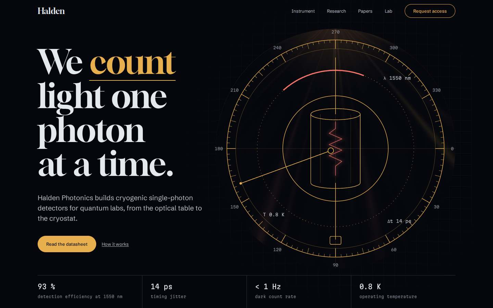 | **`apparatus-night`** A research lab after hours: violet-black air, one hand-built brass instrument glowing at the centre, an upright classical serif naming what it measures. | dark · classical-serif · yellow · soft · 5-6-6 | landing, company | Frank Ruhl Libre (serif) |
| 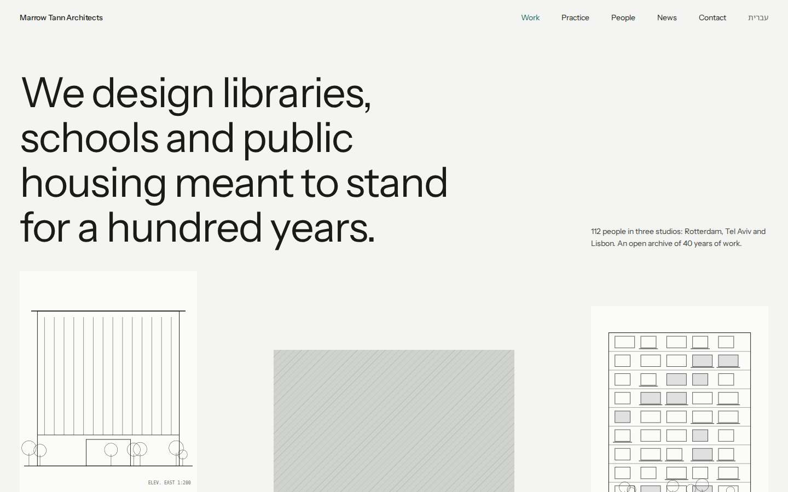 | **`architect-calm`** A large practice's quiet archive on concrete-grey paper: one regular-weight sans, photographs staggered like pinned prints, nothing raises its voice. | light · regular-grotesk · cool · 0 · 4-7-3 | company, landing | Noto Sans Hebrew (sans-neutral) |
| 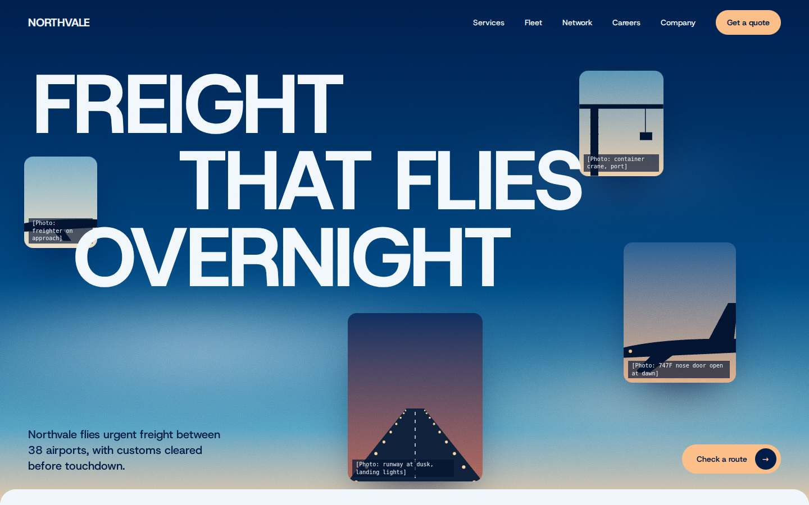 | **`atmospheric-sky`** A cargo flight at dawn: deep-blue sky dissolving to horizon light, massive white capitals flying through it, photo cards like passing windows. | dark · grotesk-caps-heavy · cool · soft · 3-6-7 | company, landing | Heebo (sans-neutral) |
| 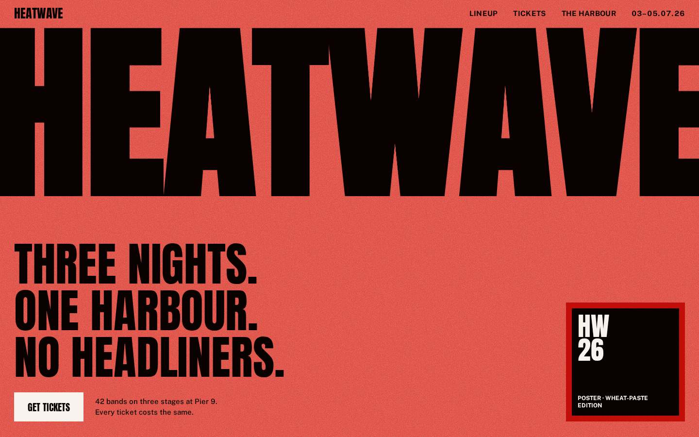 | **`billboard-type`** A wheat-pasted billboard: one saturated field, gigantic black caps cropped by the screen edges, statements instead of paragraphs. | field · display-heavy · warm · 0 · 4-9-7 | company, landing, ecommerce | Karantina (display-condensed) |
| 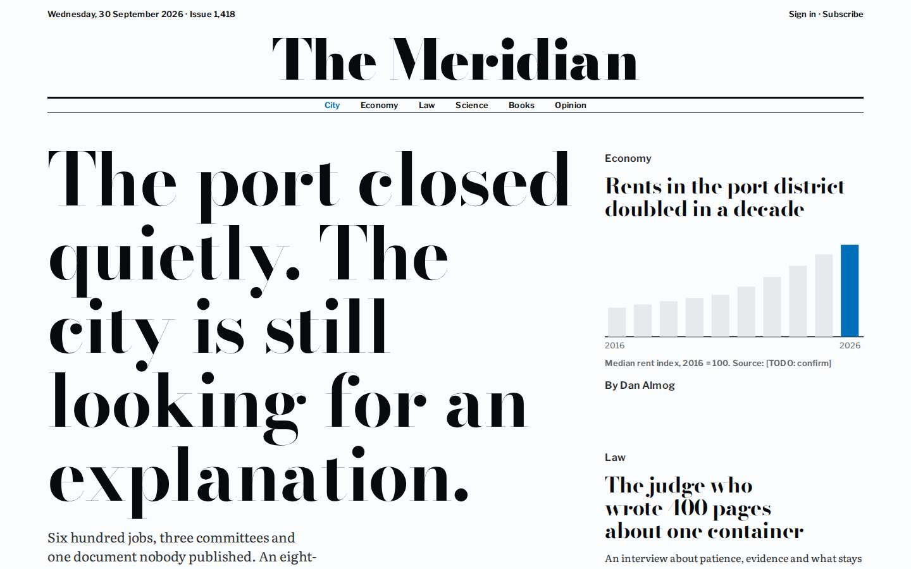 | **`broadsheet-duet`** *(guarded)* A serious weekly on bright stock: a didone headline, a text serif that reads for 20 minutes, one blue that means 'link'. | light · high-contrast-serif · cool · 0 · 7-4-1 | company, landing | Frank Ruhl Libre (serif) |
| 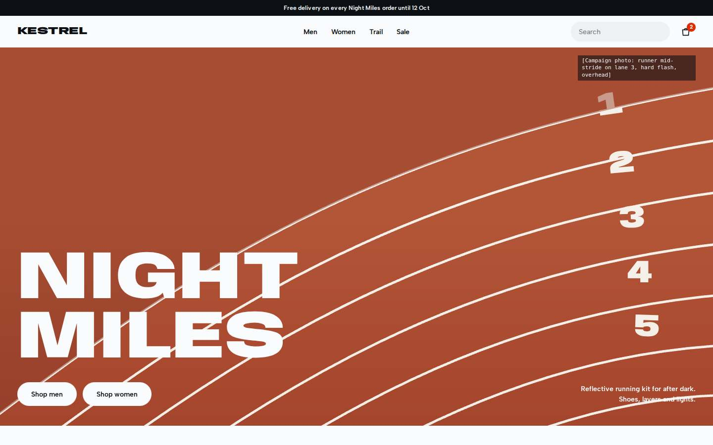 | **`campaign-commerce`** A sportswear drop: extended heavy caps punched across the campaign photo, grey-swatch product plates, a silent UI. | light · extended-heavy · warm · pill · 6-6-4 | ecommerce, landing | Heebo (sans-neutral) |
| 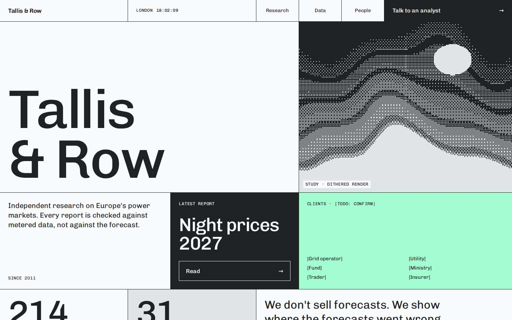 | **`cell-ledger`** A trading ledger printed on a dot-matrix: the page is a wall of 1px-ruled cells, type jumps from 16 to 180px between neighbours, art is 1-bit dithered, one mint cell glows like a live quote. | light · neo-grotesk · green · 0 · 7-6-4 | company, landing, ecommerce | IBM Plex Sans Hebrew 500 (sans-neutral) |
| 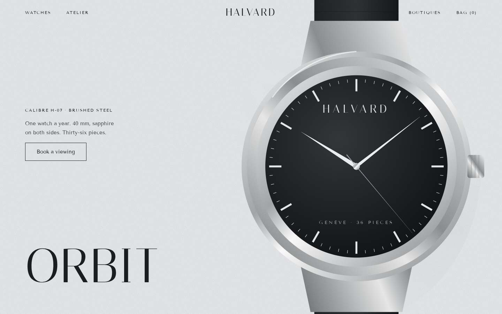 | **`cold-chrome-luxury`** A vault-grey showroom after closing: hairline didone capitals, smoke and graphite, one chrome object catching the only light. | light · hairline-didone · neutral · 0 · 2-7-5 | ecommerce, landing, company | Bellefair (serif (light)) |
| 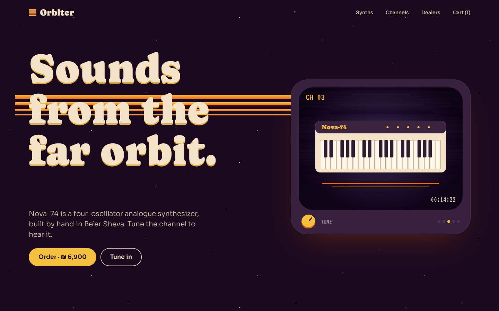 | **`cosmic-retrofuture`** A 1974 synth brochure found in orbit: aubergine space, a fat soft serif, a sunset stripe, a CRT channel you can tune. | dark · soft-serif-70s · yellow · soft · 4-8-6 | ecommerce, landing | Suez One (display-heavy) |
| 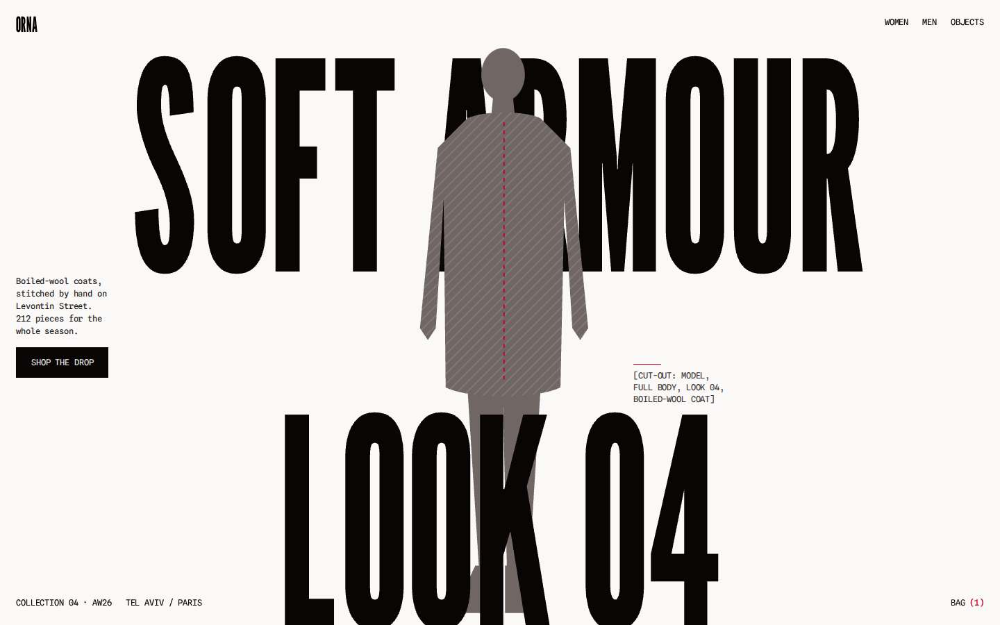 | **`couture-condensed`** An avant-garde lookbook on gallery white: cut-out models, ultra-condensed capitals as tall as the models, mono fine print, one carmine stitch. | light · ultra-condensed · warm · 0 · 5-9-7 | ecommerce, landing | Noto Sans Hebrew wdth 62.5 (sans-condensed) |
| 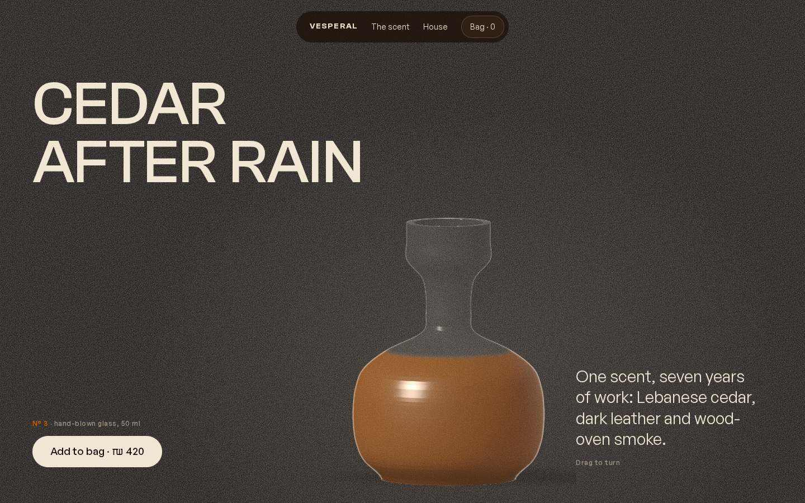 | **`darkroom-object`** A single object floating in warm walnut darkness, lit from one side; cream type is the only other thing in the room. | dark · geometric-caps · warm · soft · 3-6-6 | ecommerce, landing | Miriam Libre (sans-neutral) |
| 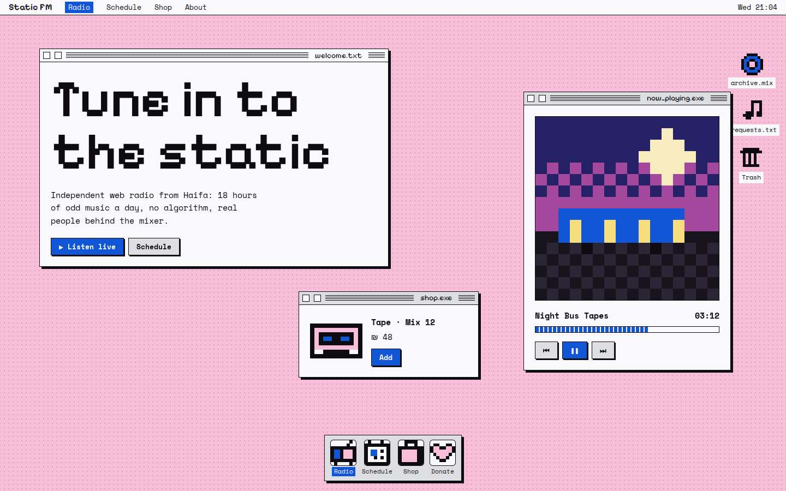 | **`desktop-y2k`** A bubblegum-pink 1998 desktop you can actually use: draggable windows, a pixel dock, TV noise between channels. | light · pixel · cool · 0 · 6-9-6 | landing, ecommerce | Rubik Pixels (display-pixel) |
| 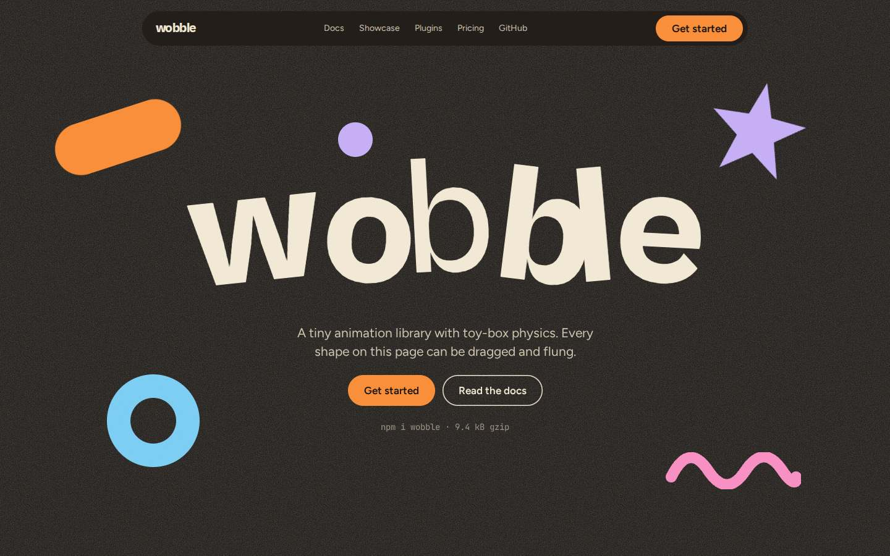 | **`dev-playground`** *(guarded)* A toy box on a warm charcoal workbench: giant cream letters that swap and wobble, candy shapes you can fling, real code that runs. | dark · grotesk-giant · multi · soft · 5-8-9 | landing, company | Heebo (sans-neutral) |
| 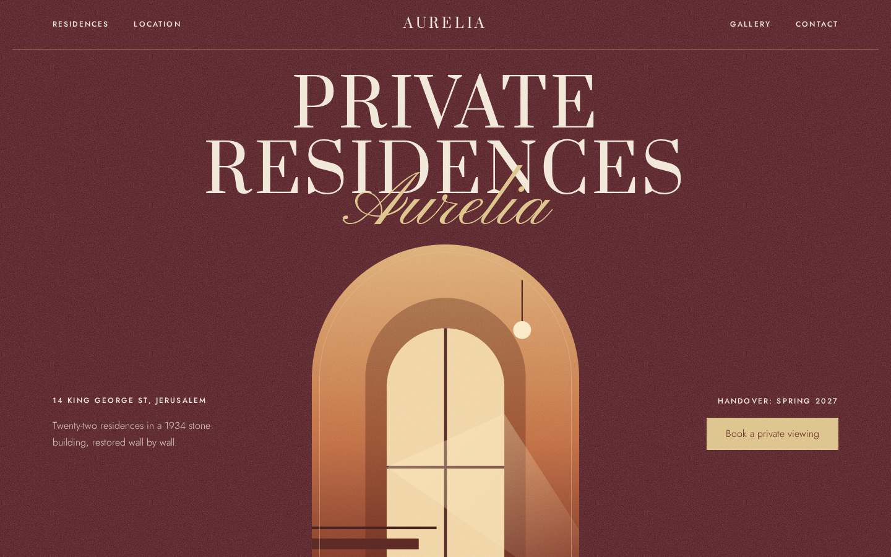 | **`estate-didone`** An engraved invitation on burgundy velvet: didone capitals with one signed script word, champagne hairlines, arch windows. | field · didone+script · warm · arch · 3-6-5 | landing, company, ecommerce | Bona Nova (serif) |
| 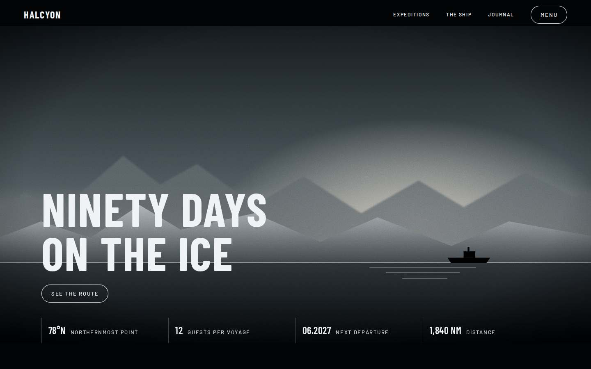 | **`film-title-bands`** An expedition film's title cards: one graded full-bleed shot, one condensed caps line with open tracking, one ghost pill per band. | dark · condensed-caps · neutral · pill · 2-5-7 | landing, company, ecommerce | Heebo (sans-neutral) |
| 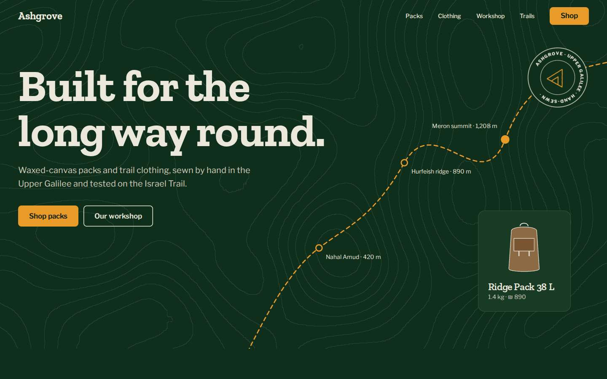 | **`forest-bone-heritage`** A ranger's field kit at dusk: deep forest canvas, bone-white slab lettering, contour lines, one amber lantern. | dark · slab · yellow · soft · 5-5-5 | ecommerce, company, landing | Suez One (display-heavy) |
| 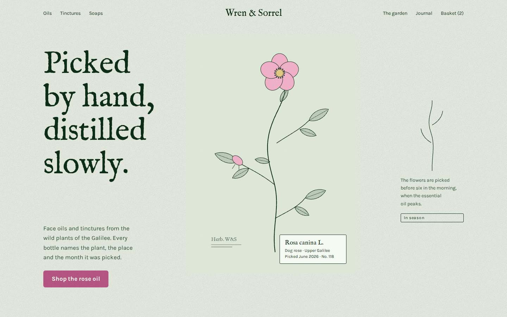 | **`herbarium`** A pressed-specimen sheet on moss-tinted paper: an old-foundry roman, botanical ink, marginal notes, self-drawing stems. | light · old-style-serif · pink · soft · 5-6-3 | ecommerce, company, landing | Noto Serif Hebrew (serif) |
| 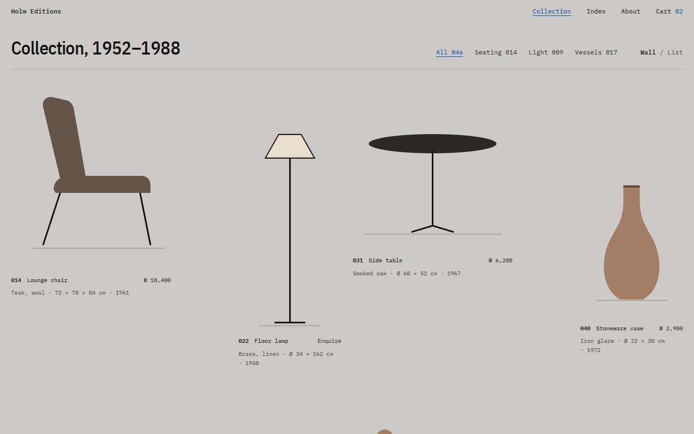 | **`index-mono-gallery`** A catalogue raisonné on gallery-wall grey: every object numbered for real, small mono, scattered across the wall at human scale. | mid · mono+condensed · cool · 0 · 7-8-4 | ecommerce, company | IBM Plex Sans Hebrew (sans-neutral (+ Cousine mono body)) |
| 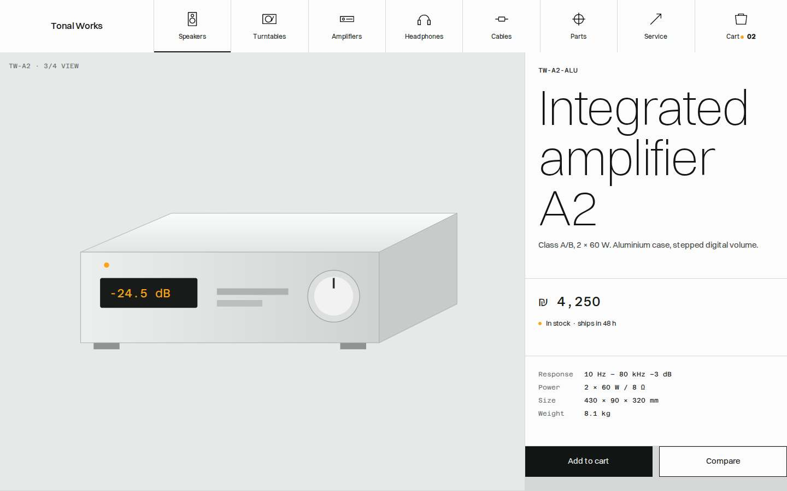 | **`industrial-catalogue`** A factory parts catalogue under even studio light: the product is the only rich object, everything else whispers in 1px cells. | light · thin-grotesk · yellow · 0 · 7-4-2 | ecommerce, company | Assistant (sans-neutral) |
| 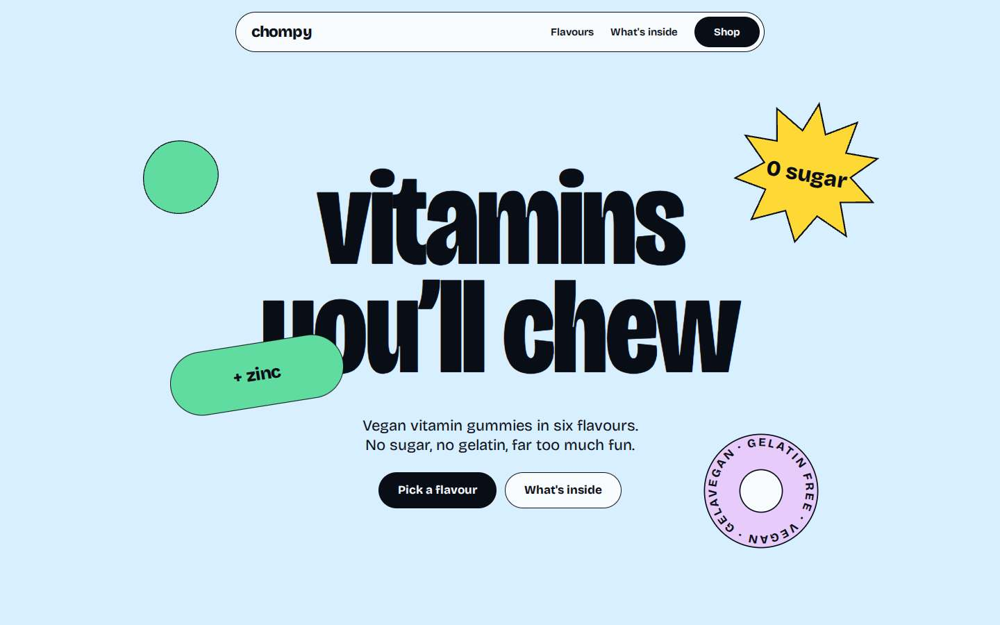 | **`inflatable-pop`** A sticker wall on sky-wash paper: crushed display words become sculptures, six sticker colours as a set, black outlines, no shadows. | light · crushed-display · multi · pill · 5-8-7 | landing, ecommerce, company | Rubik (sans-round) |
| 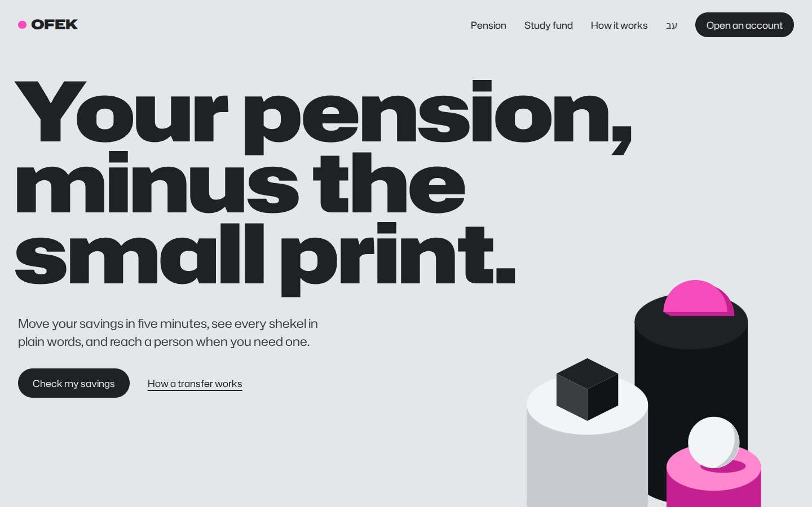 | **`kikar-heavy`** A city-square notice board in Tel Aviv: one wide, black Hebrew statement on a pale cool sheet, a built object beside it, one hot field colour saved for the moment you act. | light · wide-grotesk · magenta · pill · 4-7-5 | company, landing, ecommerce | Noto Sans Hebrew 900 (lh 0.92, -0.01em, 166-200px) (sans-neutral (heavy statement voice)) |
| 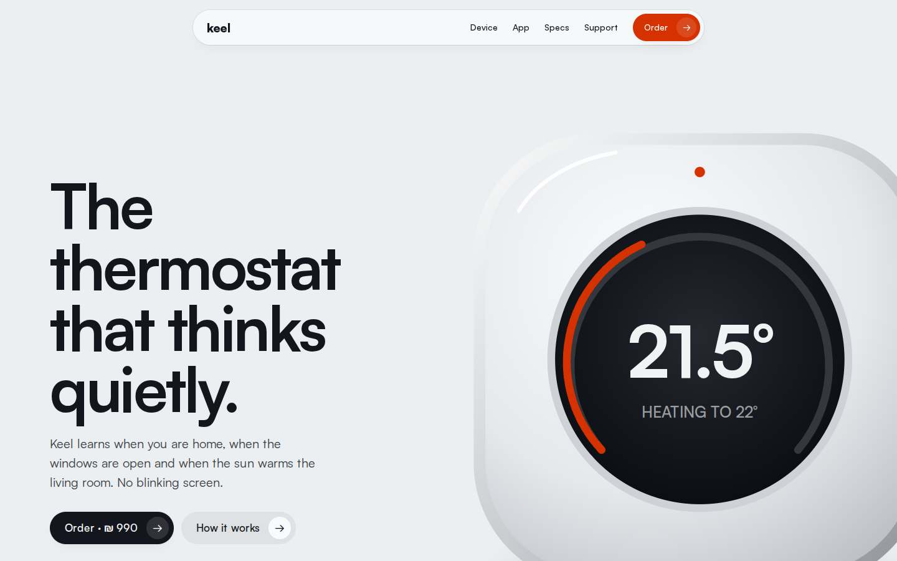 | **`machined-soft`** A precision-milled device on a silver bench: double-bezel shells, pill controls with nested icon wells, one international-orange switch. | light · grotesk-bold · warm · soft · 4-6-5 | landing, ecommerce, company | Rubik (sans-round) |
| 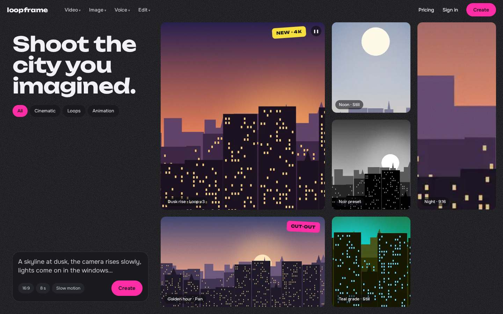 | **`media-bento-night`** *(guarded)* A late-night video wall: a dense graphite bento of real clips, sticker promo tiles at an angle, one hot-pink 'make it now'. | dark · wide-geometric · magenta · soft · 9-6-6 | landing, ecommerce | Heebo (sans-neutral) |
| 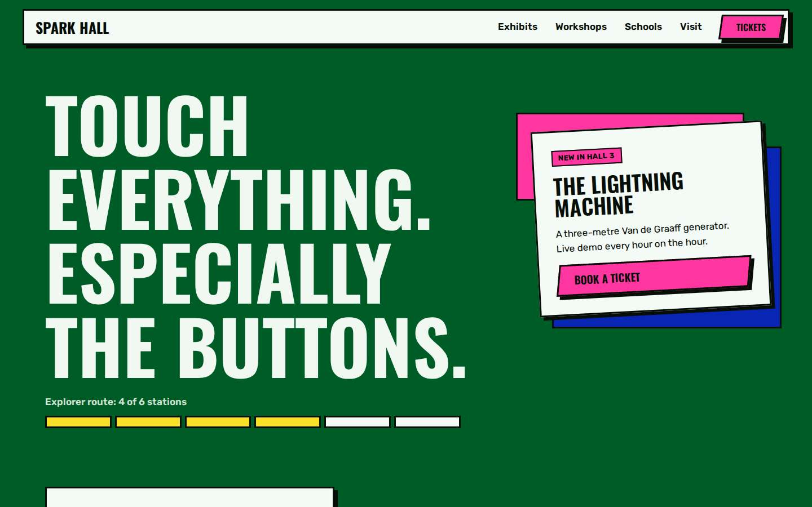 | **`neo-brutal-exhibit`** A science-museum hall painted one deep green: white placards with thick black borders, hard block shadows that lift when touched. | field · condensed-caps · green · 0 · 6-7-6 | landing, company, ecommerce | Heebo (sans-neutral) |
| 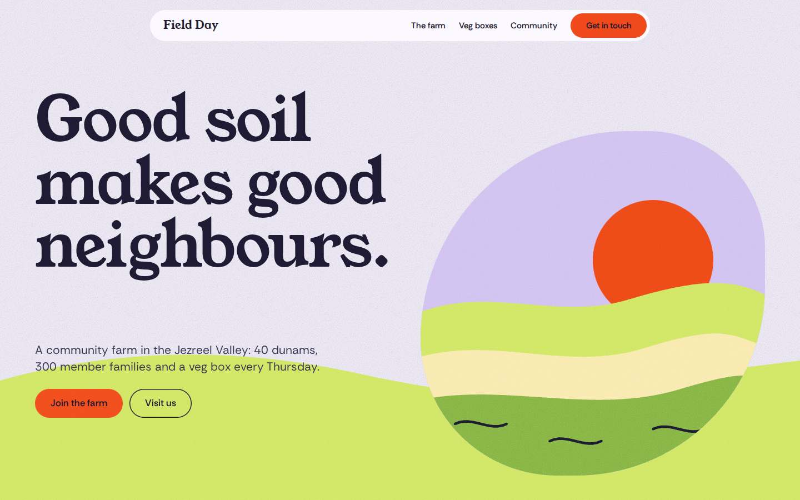 | **`organic-colour-block`** Cut-paper blobs on a lilac table: chartreuse, butter and vermilion shapes swell into sections, a chunky soft serif. | light · chunky-serif · warm · organic · 4-8-5 | company, landing, ecommerce | Frank Ruhl Libre (serif) |
| 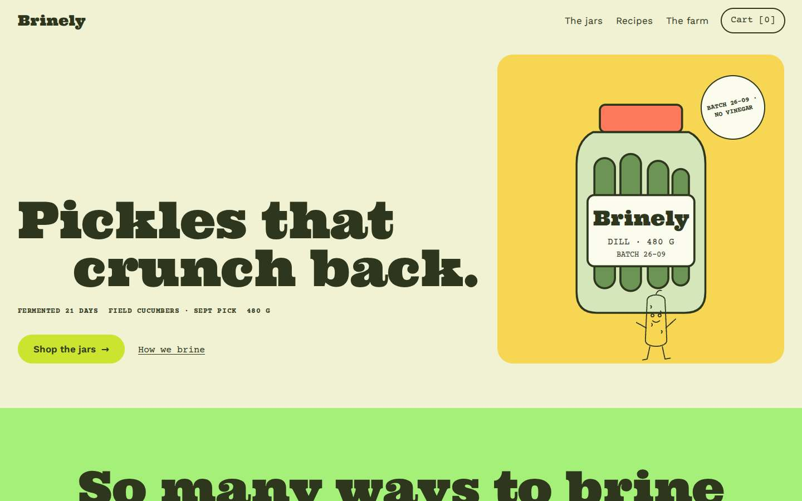 | **`pantry-label`** A pantry shelf blown up to a website: the product's own label is the design system — fat retro serif, typewriter small print, a line-drawn mascot, flat plates in the packaging colours. | light · fat-face-serif · green · soft · 6-7-5 | ecommerce, landing | Suez One (display-heavy) |
| 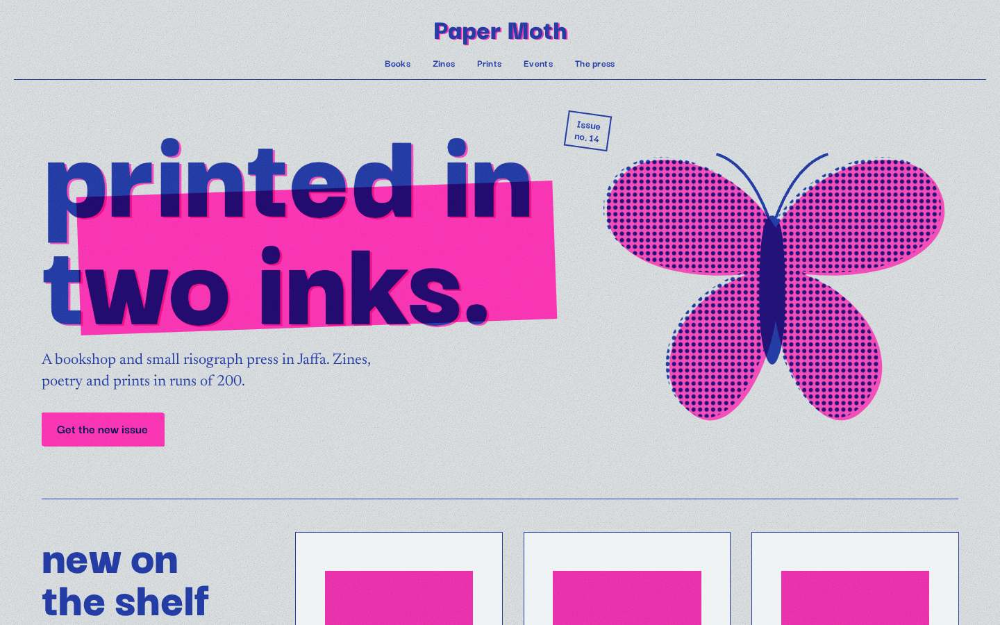 | **`riso-two-ink`** A risograph zine on cool grey stock: federal-blue ink for everything, fluorescent pink as the second drum, misregistration left in. | light · grotesk-quirky · magenta · 0 · 6-7-2 | company, landing, ecommerce | Secular One (display-heavy) |
| 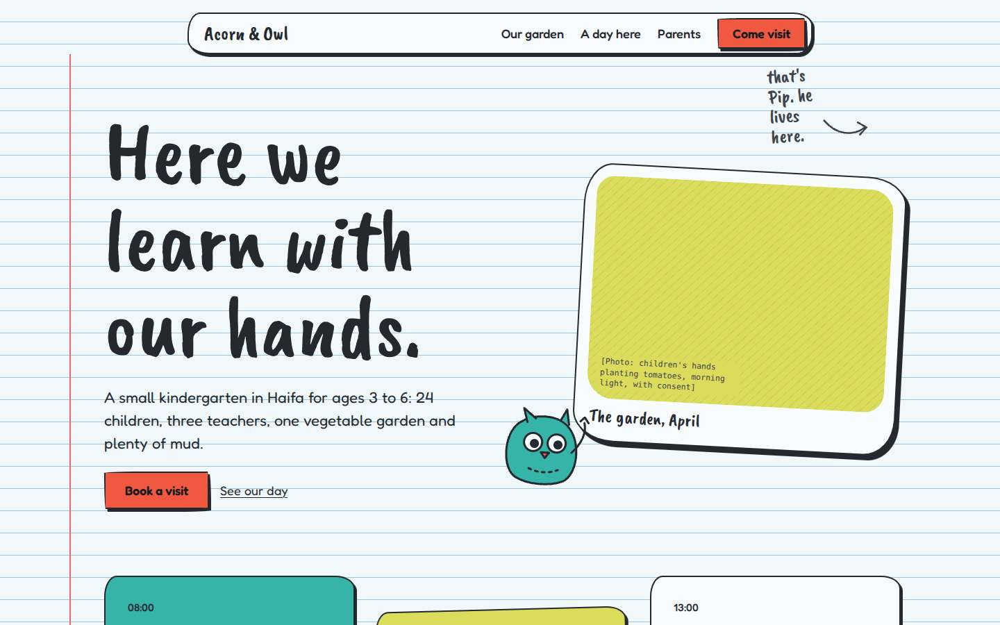 | **`storybook-sketch`** A school exercise book with blue feint lines: pencil outlines, wobbly hand-cut shapes, one character living in the margins. | light · handwritten · warm · organic · 5-7-5 | landing, company, ecommerce | Playpen Sans Hebrew (hand) |
| 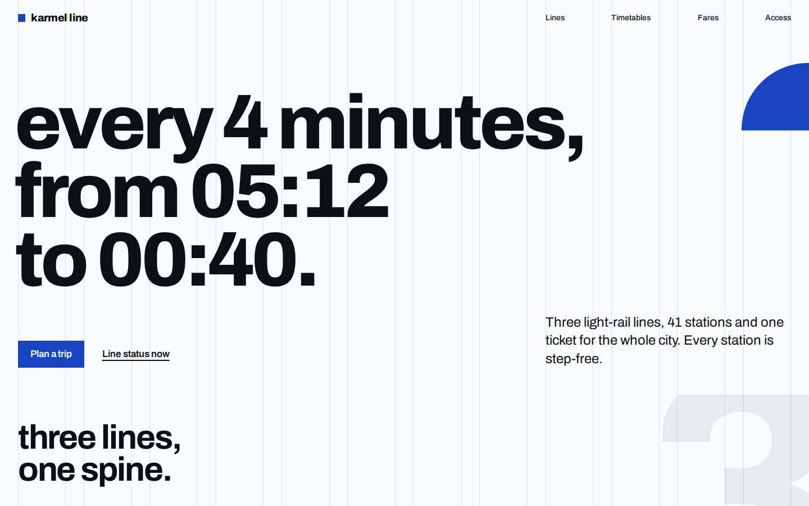 | **`swiss-signal-grid`** A transit-authority poster system: cool white sheet, the 12-column grid drawn in public, one heavy lowercase grotesk, one signal ink. | light · grotesk-heavy · cool · 0 · 6-6-3 | company, landing, ecommerce | Heebo (sans-neutral) |
| 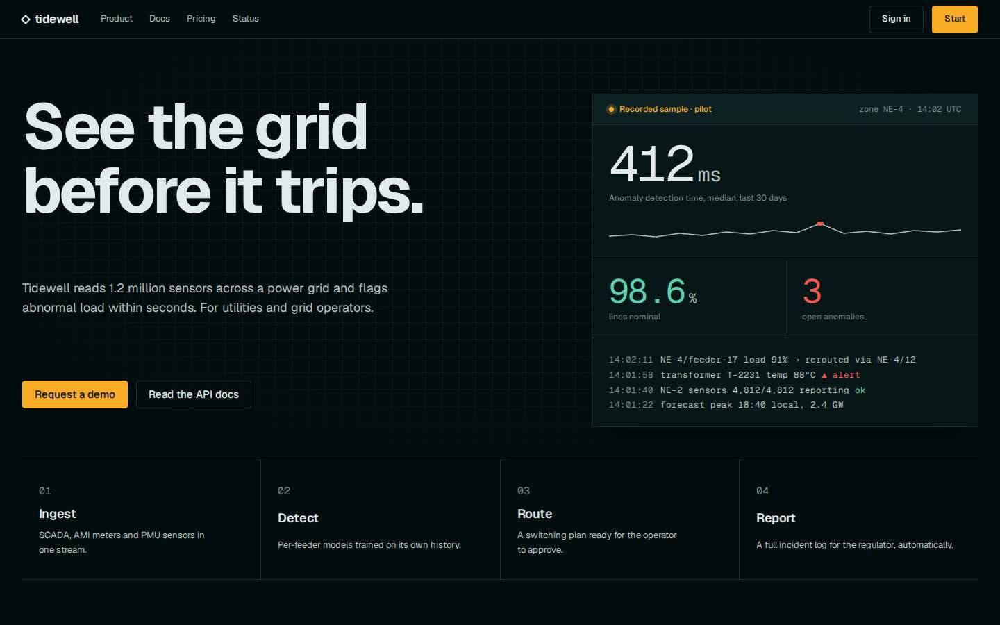 | **`telemetry-terminal`** An abyssal instrument panel: teal-black glass, phosphor numerals that are real, one sodium-amber signal for what needs your hand. | dark · grotesk-medium+mono · yellow · sharp · 8-5-5 | landing, company | Noto Sans Hebrew (sans-neutral) |
| 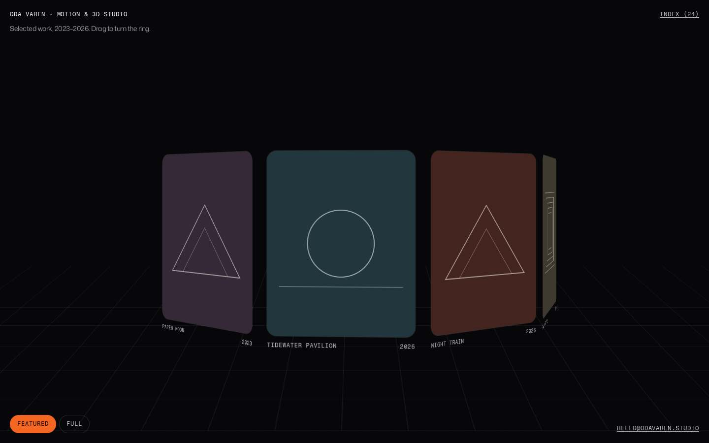 | **`void-stage`** *(guarded)* A black exhibition hall after hours: the work hangs in real 3D space (a ring of panels, a wireframe room, a spine of slivers), the interface shrinks to four corner labels. | dark · wide-grotesk · warm · soft · 3-8-9 | company, landing | Noto Sans Hebrew 600 (sans-neutral) |
| 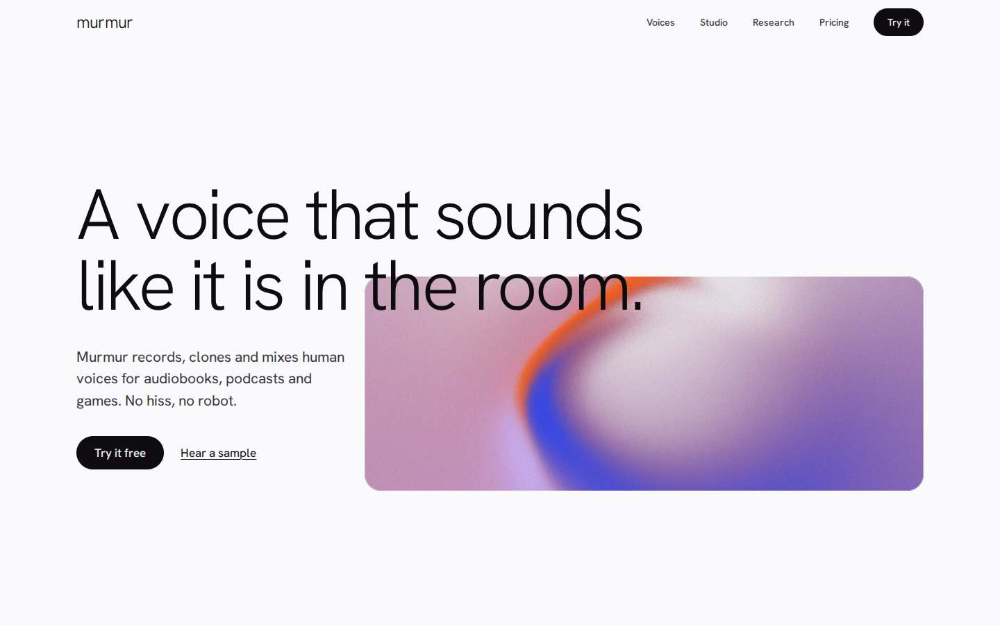 | **`whisper-studio`** A Bauhaus studio notebook on violet-grey paper: whisper-weight display, black ink, colour only inside the artwork. | light · light-grotesk · cool · soft · 3-5-4 | landing, company | Rubik (sans-round) |
| 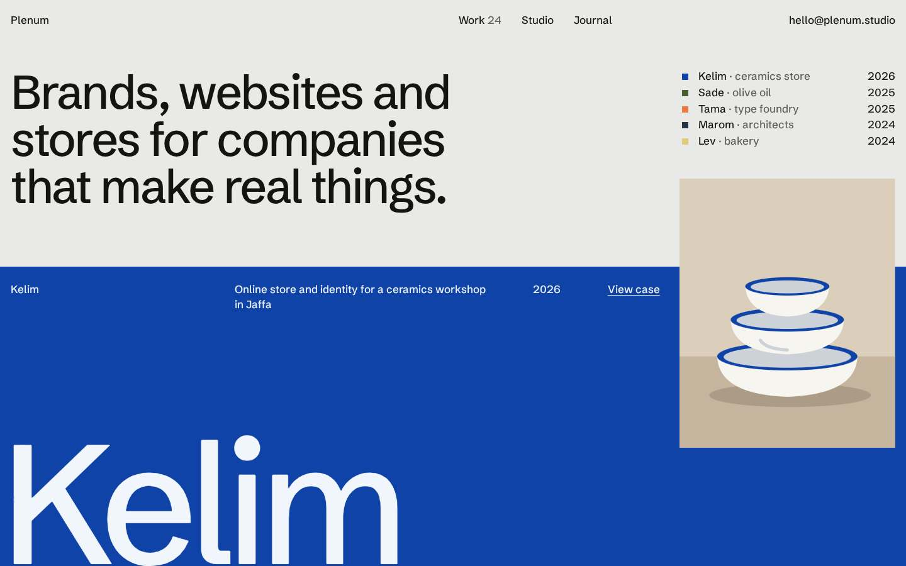 | **`work-wall-neutral`** A studio's grey pin-up wall: one grotesk at one weight, a 17px caption beside a 270px client name, no colour of its own, every project arriving in its client's colour. | light · neo-grotesk · neutral · sharp · 5-7-5 | company, landing | Heebo 500 (one weight for everything) (sans-neutral) |

## Guarded directions

| Direction | Why it's guarded | Guard |
|---|---|---|
| `broadsheet-duet` | Sits on attractor A4 (broadsheet hairlines, 0 radius) | Only when the brief says newspaper/magazine/journal, or the site has ≥6 real long-form articles; no cream paper, no hairline under every row |
| `media-bento-night` | Dark + one neon accent cluster | Accent never acid green/lime; real media fills ≥60% of the first two viewports; every tile shows real product output |
| `dev-playground` | Source look is near-black + lime (attractor A3) | Warm charcoal canvas, lime banned; every kinetic effect must demonstrate the product's capability |
| `void-stage` | Dark + 3D, next to attractor A7 (dark AI hero + floating 3D) | The 3D content is the client's real work, place or object, never an abstract sphere; poster fallback |

## Quick routing hints

These are starting points; the algorithm still runs.

- **Commerce, product-led**: pantry-label (food/drink DTC), industrial-catalogue, darkroom-object, campaign-commerce, couture-condensed, index-mono-gallery, cold-chrome-luxury, herbarium, cosmic-retrofuture.
- **Professional services / trust** (law, clinics, accounting): architect-calm, swiss-signal-grid, whisper-studio, machined-soft. Add estate-didone for private clinics, forest-bone-heritage for family firms, broadsheet-duet for firms that publish, telemetry-terminal (prose mode) for compliance/cyber.
- **B2B / corporate**: cell-ledger, atmospheric-sky, swiss-signal-grid, telemetry-terminal, film-title-bands, architect-calm.
- **Youth / consumer / events**: inflatable-pop, billboard-type, neo-brutal-exhibit, desktop-y2k, storybook-sketch, organic-colour-block.
- **Agency / studio own site**: the work supplies the colour, so accent-less directions come first. The default for a studio with ≥6 strong projects is work-wall-neutral; then void-stage, film-title-bands, swiss-signal-grid, index-mono-gallery, billboard-type, cell-ledger.
- **Israeli consumer finance, telecom, apps, public services** (Hebrew-first, statement-led): kikar-heavy, with swiss-signal-grid or cell-ledger as the cooler alternative.
- **Tech products**: telemetry-terminal, apparatus-night, whisper-studio, machined-soft, dev-playground, media-bento-night.
- **Strongest in Hebrew**: kikar-heavy (designed Hebrew-first), work-wall-neutral, swiss-signal-grid, architect-calm, telemetry-terminal, index-mono-gallery, storybook-sketch, neo-brutal-exhibit, organic-colour-block, herbarium, forest-bone-heritage. Weakest, because the signature partly depends on Latin-only features: couture-condensed, estate-didone, cold-chrome-luxury, film-title-bands. These have RTL notes.

## Colour rules shared by every direction

- `ink/canvas`, `ink-2/canvas`, `muted/canvas`, `muted/surface`, `ink/surface` and `accent-ink/accent` are all ≥ 4.5:1 (script-checked, oklch → sRGB, WCAG 2).
- Every palette drop ships a complete override of all 10 contract colour tokens, plus its measured contrast.
- When `accent/canvas` < 3, the accent is a fill colour only: never text, never a 1px line on canvas.
- `--fs-base` ≥ 16px for prose (≥ 15px in UI-dense directions); labels ≥ 12px.
- `--img-*` tokens are imagery-only colours (glazes, shader stops) and never touch text or UI.

## Adding a direction

See [CONTRIBUTING.md](../CONTRIBUTING.md#adding-a-direction). Copy an existing direction file as the template, implement the whole token contract, add a row to `_index.md` (both tables) with reciprocal neighbours, build a specimen, shoot it with `_specimens/_shoot.mjs`, and rebuild the montages with `_specimens/_montage.py`.
