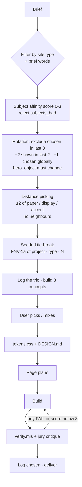

# How it works

`studio-design/SKILL.md` is short on purpose. It holds the process, a file map, ten non-negotiables and the variety engine. Everything else is loaded on demand, so Claude reads only the 3 shortlisted direction files, the page set it needs and the catalog sections it uses.

## 1. Brief (no interrogation)

Claude extracts:

- **subject**: industry, materials, artefacts, vernacular,
- **audience**,
- **site type**: `ecommerce` / `landing` / `company`,
- **the one job** of the site,
- **tone as an extreme** ("clean and modern" is not a tone),
- language and direction,
- brand assets,
- scope.

Missing pieces are inferred and stated in one line. Claude asks at most one question, and only when two readings would produce different sites.

## 2. Three directions: the selection algorithm

The full algorithm is in `studio-design/directions/_index.md`. In short:

1. **Hard filter by site type.** Keep directions whose `fits` includes the requested type.
2. **Brief-word override.** Named colours, fonts, references or looks keep the directions that honour them. Two special paths:
   - **Brief-fixed palette.** Client colours are mapped to token roles with measured contrast. Distance is then measured on display class, Hebrew display class, hero archetype, radius and motion (at least 2 of 5 must differ).
   - **Prior stated preference.** A direction the user already liked goes straight into the trio (it may bypass `fits` with a one-line adaptation) and is exempt from penalties.
3. **Subject affinity (0–3).** +2 if the subject is in `subjects_good`, +1 if the tone words match the direction's essence, reject if the subject is in `subjects_bad`. Guarded directions need +2 *and* their guard condition.
4. **Recency rotation.** Uses both logs (see [getting-started.md](getting-started.md#rotation-logs)). Directions whose (paper, display) pair is absent from the last 5 global runs are preferred. The hero device (`lathe-render | device-render | drawing | photo | video | type-only | media-collage | data-viz | illustration`) must differ from the last chosen run.
5. **Distance picking.** #1 is the highest score. #2 is the best that differs from #1 on at least 2 of {paper band, display family, accent band} and isn't a neighbour. #3 differs from both. If nothing qualifies, the rule relaxes to 1 axis + a different radius system, and Claude says so.
6. **Seeded tie-break.** `seed = FNV-1a 32-bit("<project>|<site_type>|<N>")`, where N is the number of prior runs for the project. Tied candidates are sorted alphabetically, rotated left by `seed mod k`, and the first is taken. The seed never overrides filters or penalties.
7. **Present the trio** in one line each, with a "differs from last" note.
8. **Log immediately**, every run, before any concept is built.

**Never fail to produce a trio.** Trust briefs (law, clinics, accounting, public sector) often leave fewer than 3 candidates. The relax order is: add score-0 directions with a stated adaptation → allow a guarded direction → relax distance → allow a neighbour pair in different paper and drop → last resort, one direction in two palette drops labelled as variants.

### The axes

| Axis | Values |
|---|---|
| `paper_band` | `light` (canvas L > 85%) · `mid` (60–85%) · `dark` (L < 30%) · `field` (saturated full-page colour) |
| display family | `serif` · `grotesk` · `condensed` · `special` (mono, pixel, handwritten) |
| accent band | warm · yellow · green · cool · magenta/pink · neutral (no accent) · multi (fixed set) |
| `radius_system` | 0 · sharp (2–4px) · soft (8–32px) · pill · organic/arch |
| D-V-M | density, variance, motion budget (0–10 each) |
| Hebrew display class | sans-neutral · sans-round · sans-condensed · serif · display-heavy · display-condensed · display-pixel · hand |

Coverage across the 33 directions: paper light 19 · mid 1 · dark 10 · field 3. Display serif 9 · grotesk 15 · condensed 6 · special 3.

## The ambition floor

Restraint isn't the same as blandness. Every concept, the quiet directions included, needs:

- **A first viewport that would stop a scroll.** At least one of: display type ≥6vw (or a giant cropped word), full-bleed art-directed media, a live background (shader, canvas, scrub video), or a built signature object (3D sphere, CSS/SVG subject object, draggable window, map).
- **At least one wow moment further down.** Pinned sequence, horizontal track, stacked cards, clip-reveal gallery, kinetic chapter word at 160–350px, scroll-scrubbed media, index↔grid Flip, colour chapters (`tone-shift`), an object travelling through the page (`travel`), an image scatter field around a word (`scatter`).
- **A "second read".** A detail you notice on the second visit: an annotation, a micro-interaction, a hover reveal, a typographic joke from the subject's vernacular.

Before showing the concepts, Claude ranks them on "would this get Site of the Day?" and fixes the weakest until all three clear the floor.

## 3. Lock the system

The chosen direction (plus one palette drop and 2–3 knobs) produces:

- `assets/tokens.css`: the full **token contract**. Colours `--c-*`, fonts `--f-*`, sizes `--fs-*`, spacing `--sp-*`, radii `--r-*`, easings and durations, shadows. Every colour, font and size in the project is a `var(--token)`.
- `DESIGN.md`: about 50 lines covering direction, tagline, tokens, type roles, radius system, card physics, button voice, nav and footer archetypes, background family, motion budget and signature moment, imagery rules, RTL notes, Do/Don't.

From here the rule inverts: **all pages share one system, and variety lives inside it** through section choice, knobs, content, imagery and one signature moment per page. It never comes from new colours, fonts or radii on some pages.

## 4. Plan every page

The core page list comes from `pages/<type>.md`. Each page gets sections in DOM order with catalog ids, its one signature moment, and a motion spec table (element · trigger · property · duration · ease · reason). The composition rules are mechanical:

- no two sections of the same archetype on a page,
- at least ceil(n/2) layout families, with no family more than twice in a row,
- zig-zag at most 2 in a row, marquee at most 1 per page, eyebrows at most ceil(sections/3),
- the hero fits 1280×800 (H1 ≤ 2–3 lines, ≤ 4 text elements), and is never the 100vh centred badge-H1-two-buttons hero,
- proof, pricing and footer shapes are chosen, not defaulted,
- honest content: no invented numbers, logos, testimonials or people,
- **self-similarity test**: "would a similar brief land on the same page?" If yes, change an axis and say which.

## 5. Build

- One complete HTML file per page and no truncation ("same as above" is forbidden).
- CSS order: `runtime/core.css` → `assets/tokens.css` → `runtime/fx/*.css` → `assets/site.css`.
- Effects are declarative (`data-fx="hscroll"`), so they port to ACF blocks.
- Semantic HTML, one `<h1>`, logical CSS properties, `100dvh` not `100vh`, `overflow-x: clip`, width/height on images, a non-lazy LCP image with `fetchpriority="high"`.
- Every page renders its final state without JS, and `prefers-reduced-motion` is respected.
- WebGL sits on top of real DOM content and is never a gate.
- Accessibility is part of the design (WCAG 2.2 AA / SI 5568): focus never hidden under the sticky header, scroll-lit text recedes by colour rather than opacity, forms have an error summary, and pages reflow at 320px.

**Imagery**, in order of preference:

1. the user's photos and brand assets,
2. generated images (if the session has an image tool),
3. subject objects built in code (`lathe` for turned objects, `device` for box-shaped products, CSS/SVG drawings, maps, diagrams),
4. labelled slots (`[Photo: <exact shot needed>]`).

Random stock that doesn't match the subject is never used.

## 6. Verify

`verify.mjs` screenshots every page and runs 27 automated checks. Claude then **opens the screenshots and critiques them like a jury**: hierarchy, specificity to the subject, restraint ("remove one accessory"), variety, execution. It fixes and re-runs until nothing fails. See [quality.md](quality.md).

## 7. Log and deliver

The rotation entry is completed (`log-run.mjs chosen …`). The delivery is `_gallery.html`, `DESIGN.md`, a short placeholder note and, for WordPress, an ACF mapping.

## Precedence

When rules disagree:

**the brief's explicit words > the chosen direction's signature moves > catalog defaults > general rules.**

Bans in `antipatterns.md` are defaults too; only the brief's words override them. Every override is stated in `pages.md`.

## The variety engine

Why two runs of the same brief come out different:

- Choices come from the subject first and the catalog second.
- The trio rule: concepts differ on at least 2 visual axes *and* on hero, nav, card and motion archetypes.
- Rotation memory in two logs, plus a seeded tie-break.
- Each direction has knobs and 3 palette drops, and each section archetype has 3 knobs. At least one changes whenever an archetype repeats across projects.
- Every page owns one signature moment.
- `antipatterns.md` keeps a **current attractors** block (A1–A25): yesterday's anti-slop look becomes today's slop, so it's re-checked as new scans arrive.

## Non-negotiables (from SKILL.md)

1. Style comes from the subject's world, never from the last site you made.
2. One accent at most, and often none. About half of ~200 award sites use no saturated accent. Institutional brands keep 1–2 brand colours, at ≤5% of any viewport.
3. At most 3 font families. No default Inter/Roboto/Poppins/Montserrat display, and no reflex Fraunces/Instrument Serif/Space Grotesk.
4. Big type contrast: hero display median 64–80px at 1440. The biggest word on the site (160–350px) is usually a chapter word, not the H1.
5. Dense grids (gap 2–12px), generous sections (~90–170px padding, asymmetric).
6. One radius system (0 / soft / pill ≈ 29/47/23% of award sites), and no soft card shadow (under 2% of ~180 sites).
7. Motion has a budget and a reason: one orchestrated entrance, one signature scroll moment per page.
8. Proof is real and designed; no "99.9% · 10x · 24/7" strips.
9. Navigation and footers are designed objects.
10. No fake chrome, emoji icons, Lorem, Acme or em-dashes in copy.
